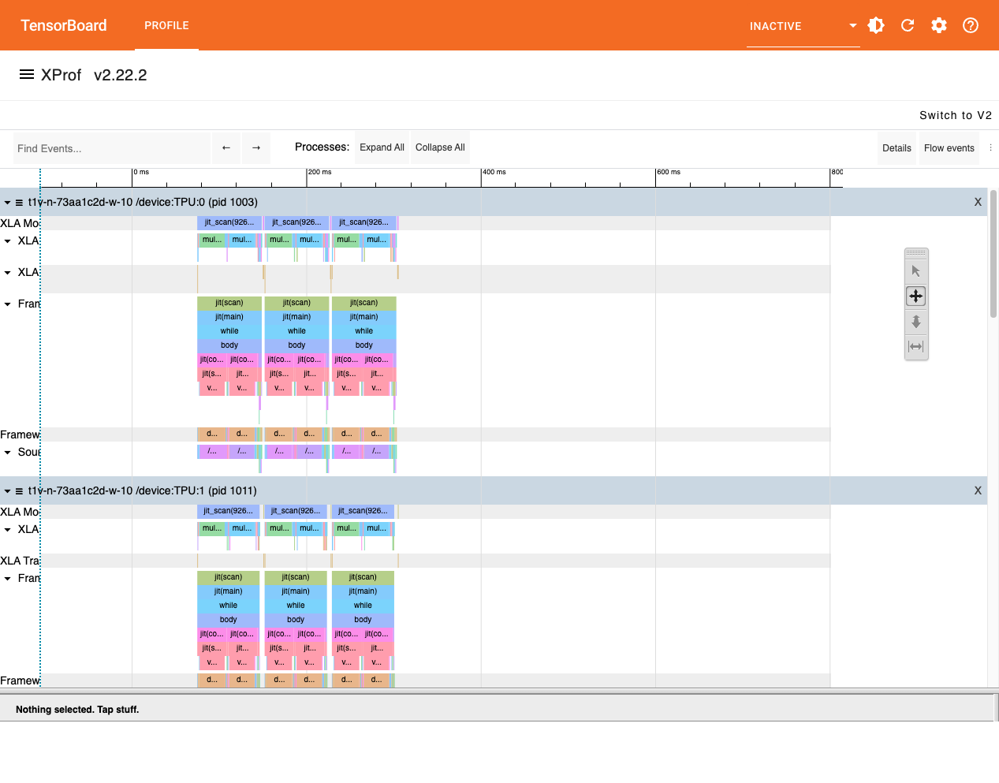

# Google TPU D3Q27 SoA Profiler Assessment

Date: May 7, 2026

## Executive Summary

We validated a sanitized D3Q27 JAX LBM boilerplate on the 64-chip TPU v6e pod using the production-oriented `(X,Y,Z,3) x 9` Struct-of-Arrays layout. The largest run reached a 1-billion-voxel grid (`1024 x 1024 x 1000`) and completed cleanly with finite fields, stable density bounds, and no evidence that ICI halo exchange is the dominant bottleneck.

The most important finding is that the runtime is dominated by the fused Cumulant/moment transform kernel, specifically XLA `multiply_reduce_fusion.*` blocks sourced from the shifted Cumulant collision math. The network halo exchange appears small in the process-0 trace compared with the fused compute block.

## What We Built

- A clean D3Q27 JAX boilerplate for Google infrastructure review.
- A TPU-compatible SoA layout: `(X,Y,Z,3) x 9`.
- A stable `voxel_vmap` collision mode that computes hydrodynamic quantities lazily from the 9 SoA groups.
- `jax.lax.scan` time stepping to prevent Python-loop HLO unrolling.
- Branchless masking for wall/open-boundary style operations.
- Process-scoped JAX profiling hooks:
  - `--profile-dir`
  - `--profile-name`
  - `--profile-processes process0`

## What We Proved

1. The 64-chip TPU v6e pod can run the 1-billion-voxel D3Q27 SoA workload.
2. The SoA memory layout avoids the earlier monolithic `(X,Y,Z,27)` allocation cliff.
3. The `voxel_vmap` path is the stable Google-facing execution path.
4. The ICI/network halo path is not the primary runtime bottleneck in the captured traces.
5. XLA is spending most of its time in fused multiply-reduce Cumulant/moment transforms.

## Benchmark Results

### Baseline SoA 1B Run

Source: `results/d3q27_soa_boilerplate_1024x1024x1000_10step.json`

```json
{
  "global_shape": [1024, 1024, 1000],
  "devices": 64,
  "hosts": 16,
  "timed_steps": 10,
  "step_seconds": 0.6536441439999976,
  "glups": 1.604200098211243,
  "max_velocity": 0.020015714690089226,
  "rho_min": 0.9869076013565063,
  "rho_max": 1.0242279767990112,
  "passed": true
}
```

### Vmap/SRAM-Fusion 1B Run

Source: `results/d3q27_soa_boilerplate_vmap_1024x1024x1000_10step.json`

```json
{
  "global_shape": [1024, 1024, 1000],
  "devices": 64,
  "hosts": 16,
  "timed_steps": 10,
  "step_seconds": 0.6438548762002029,
  "glups": 1.6285906013297808,
  "max_velocity": 0.020015714690089226,
  "rho_min": 0.9869076013565063,
  "rho_max": 1.0242279767990112,
  "passed": true
}
```

This is a modest positive improvement over the previous full-local-27-channel compute path: about `1.52%`.

### Profiled 512 Run

Source: `results/profile_voxel_vmap_512x512x500_3step.json`

```json
{
  "global_shape": [512, 512, 500],
  "devices": 64,
  "hosts": 16,
  "timed_steps": 3,
  "step_seconds": 0.07722084233440303,
  "glups": 1.697365582110537,
  "collision_mode": "voxel_vmap",
  "profile_processes": "process0",
  "max_velocity": 0.019992828369140625,
  "rho_min": 0.9905827641487122,
  "rho_max": 1.0179578065872192,
  "passed": true
}
```

### Profiled 1B Run

Source: `results/profile_voxel_vmap_1024x1024x1000_3step.json`

```json
{
  "global_shape": [1024, 1024, 1000],
  "devices": 64,
  "hosts": 16,
  "timed_steps": 3,
  "step_seconds": 0.6443396653339732,
  "glups": 1.627365280168657,
  "collision_mode": "voxel_vmap",
  "profile_processes": "process0",
  "max_velocity": 0.019992828369140625,
  "rho_min": 0.9896554946899414,
  "rho_max": 1.0179983377456665,
  "passed": true
}
```

## TensorBoard Trace Viewer

Screenshot from the process-0 `512 x 512 x 500` trace:



TensorBoard loaded the XProf Profile tab successfully after preserving the expected `plugins/profile/<session>/...` directory layout. It reported a warning that no step marker was present, which is expected for this low-level JAX benchmark because we did not add explicit TensorBoard step instrumentation. The trace itself still contains usable XLA timelines.

## Heaviest Compute Block

The heaviest visible block is:

`multiply_reduce_fusion.4`

For the `512 x 512 x 500` trace:

```text
duration:       28,682.945 us
category:       loop fusion
shape:          bf16[8,512,500,27]
bytes accessed: 356,370,208
model flops:    11,888,640,000
source:         /home/apple/skanda_simulation/shifted_cumulant_lbm.py:322
tf op path:     jit(scan)/jit(main)/while/body/jit(collide_local)/jit(shmap_body)/vmap(...)/dot_general
```

For the `1024 x 1024 x 1000` trace:

```text
duration:       247,399.766 us
category:       loop fusion
shape:          bf16[16,1024,1000,27]
bytes accessed: 2,850,833,664
model flops:    95,109,120,000
source:         /home/apple/skanda_simulation/shifted_cumulant_lbm.py:322
tf op path:     jit(scan)/jit(main)/while/body/jit(collide_local)/jit(shmap_body)/vmap(...)/dot_general
```

Interpretation: XLA is spending the bulk of its time applying the fused D3Q27 Cumulant/moment transform. This is effectively the per-voxel multiply-reduce work over the 27 population channels and the associated transform matrices.

## Bottleneck Hunt

### ICI / Network

The trace contains `collective-permute` events, which correspond to the halo-exchange path.

For the 1B trace:

```text
collective-permute count:    144
collective-permute total:    6.580 ms
collective-permute max:      0.888 ms
```

This is small compared with the heaviest fused compute block at about `247.4 ms`. The captured process-0 profile does not support the conclusion that network halo exchange is the main bottleneck.

### MXU / Fused Math

For the 1B trace:

```text
fusion event count:          2700
fusion aggregate trace time: 7167.107 ms
largest fusion block:        247.400 ms
largest block name:          multiply_reduce_fusion.4
```

The largest compute blocks are the Cumulant/moment transform operations. This is the main optimization target.

### HBM Spill / Copy / Reshape Signals

For the 1B trace:

```text
copy count:                  4251
copy aggregate trace time:   268.863 ms
copy max:                    2.644 ms
reshape count:               84
reshape aggregate trace time:3.443 ms
dynamic-slice count:         0
slice aggregate trace time:  185.585 ms
```

There are many copy/slice events, but no single huge copy or dynamic-slice block stands out as the primary smoking gun. The largest operation remains the fused Cumulant multiply-reduce. That said, the copy/slice aggregate is non-trivial and is worth reviewing with Google once they inspect the `.xplane.pb` in their internal tooling.

## Current Technical Conclusion

The bottleneck is compute/memory inside the fused Cumulant transform, not ICI. The next useful optimization work should focus on how XLA lowers the 27-channel moment transform:

- whether the `27 x 27` transforms can map better to MXU tiling,
- whether we can reduce bf16/f32 conversion overhead,
- whether copy/slice traffic around the SoA-to-compute layout can be reduced,
- whether Google can expose a better lowering for this small-matrix batched transform pattern.

## Known Caveats

- The trace is process-0 only. It is enough for kernel-level timeline inspection, but it is not a full all-host distributed trace.
- TensorBoard showed `No step marker observed`, because the benchmark is low-level JAX/XLA rather than Keras-style instrumented training.
- The legacy `local_aos` comparator stalled under the current TPU/XLA lowering even on small grids. The stable path is `--collision-mode voxel_vmap`.
- The repository is intentionally sanitized for Google infrastructure review and omits proprietary production physics modules and client geometries.

## Files To Share With Google

- `d3q27_soa_boilerplate.py`
- `requirements-tpu.txt`
- `launch_tpu_v6e64_d3q27_soa.sh`
- `RESULTS.md`
- `GOOGLE_TPU_PROFILER_ASSESSMENT.md`
- `results/profile_voxel_vmap_512x512x500_3step.json`
- `results/profile_voxel_vmap_1024x1024x1000_3step.json`
- `results/profiles/profile_voxel_vmap_512x512x500_3step/`
- `results/profiles/profile_voxel_vmap_1024x1024x1000_3step/`
- `results/tensorboard_trace_viewer_512_heaviest_block.png`

## Recommended Next Steps

1. Ask Google to inspect `multiply_reduce_fusion.4/.5` lowering in the `.xplane.pb` traces.
2. Ask whether the D3Q27 `27 x 27` transform can be lowered to a more MXU-friendly tiled matmul pattern.
3. Evaluate Pallas co-engineering: if XLA's automatic lowering cannot natively tile this `27 x 27` transform into SRAM without excessive HBM copying, we would like to collaborate with Google's team to write a custom JAX Pallas micro-kernel for this specific `dot_general` block. We know the TPU network path can scale; the goal is to use Pallas to unlock MXU utilization for the Cumulant transform.
4. Investigate whether the copy/slice aggregate is layout-conversion overhead from the SoA-to-compute path.
5. Add explicit step markers in a follow-up profiling run to improve TensorBoard/XProf summary attribution.
6. Capture a full multi-host trace only after the process-0 analysis is complete, because all-host tracing is more likely to perturb the benchmark.
